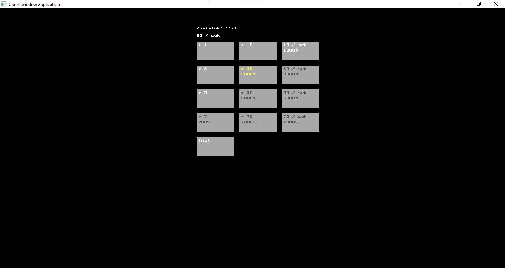

# Click Bajt

Click Bajt is a simple interactive text-based game that combines a shop management aspect with an incremental clicker mechanic. The player can make purchases from a variety of items in the shop, accumulate currency, and automate the process to increase their earnings over time.

## Features

### Shop Management

-   The game consists of a shop with various items available for purchase.
-   Each item has a specific value, cost, and the option to automate the purchase (auto-click).

### Currency System

-   Players have a balance of currency ("Zostatok") that they can use to buy items from the shop.

### Incremental Clicker Mechanic

-   Players can manually click on certain items in the shop to make purchases and increase their currency balance.
-   Some items can be automated to generate currency at a specific rate per second ("autoPeniaze").

### Save and Reset

-   Players can save their progress and later resume the game from where they left off.
-   There's an option to reset the game and start from scratch.

## Controls

-   Use the arrow keys to navigate the menu options.
-   Press ENTER to select an option.
-   In the game, use arrow keys to move the cursor, and ENTER to interact with the shop items.

## How to Play

1. **Start the Game:**

    - Run the program, and you'll be presented with a menu.
    - Use the arrow keys to select an option and press ENTER.

2. **Shop Management:**

    - Navigate through the shop items using arrow keys.
    - Press ENTER to make a purchase or interact with an item.

3. **Incremental Clicking:**

    - Manually click on certain items to make purchases and increase your currency balance.

4. **Automation:**

    - Some items can be automated to generate currency automatically.
    - Keep an eye on your "Zostatok" and automate purchases strategically.

5. **Saving Progress:**

    - Use the "Ulozit" (Save) option in the menu to save your progress.
    - Progress can be resumed later from the main menu.

6. **Resetting the Game:**

    - Use the "Vymazat priebeh" (Reset Progress) option to start the game from the beginning.

7. **Exiting the Game:**
    - Choose the "Koniec" (End) option to exit the game.

## Screenshots

Feel free to enjoy the game and see how efficiently you can manage your shop to maximize earnings!
